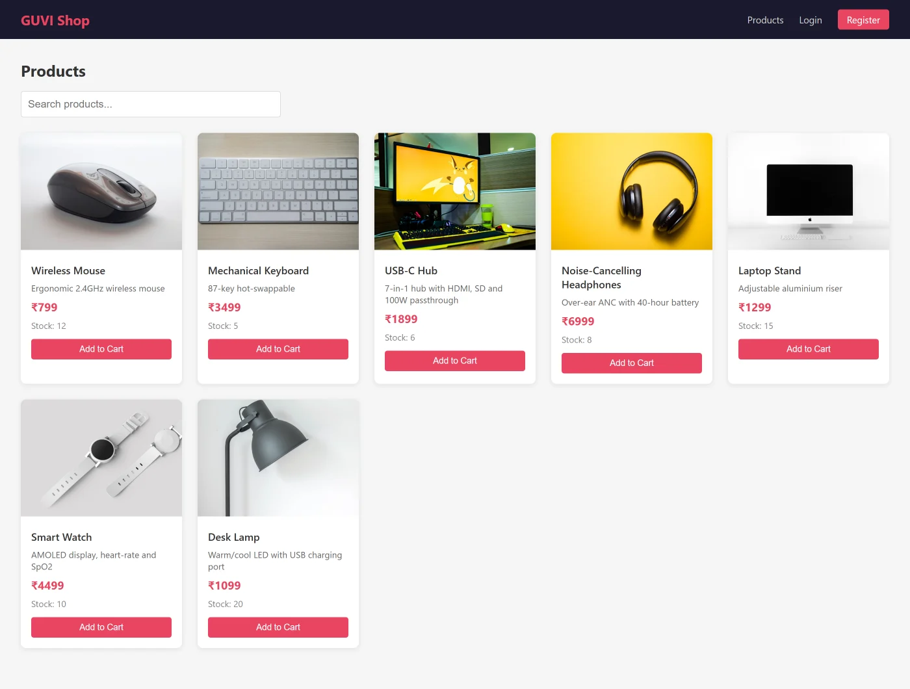
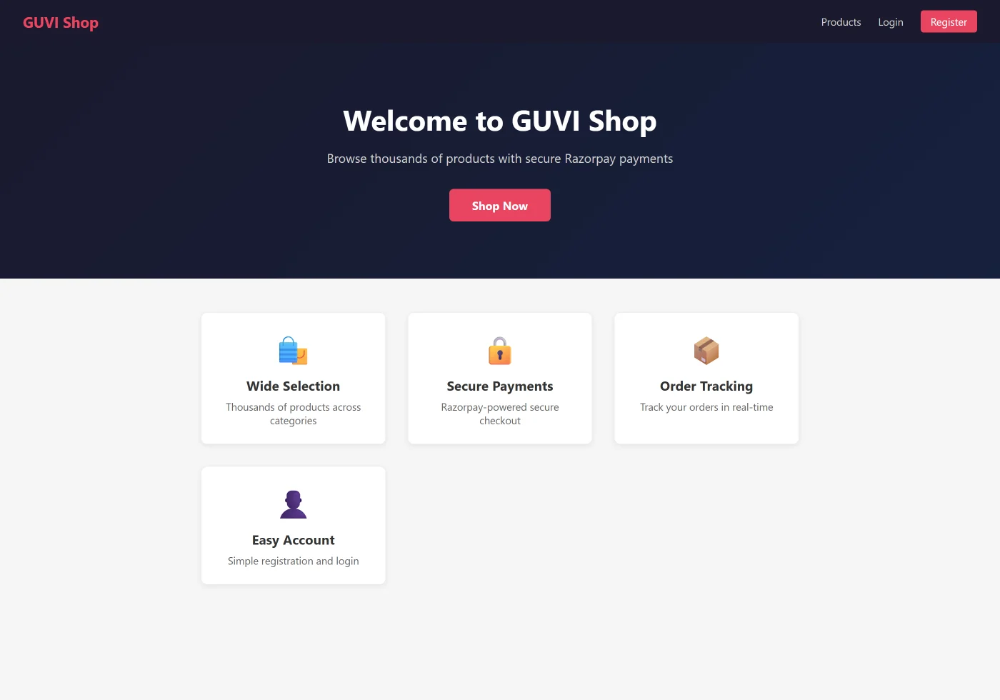
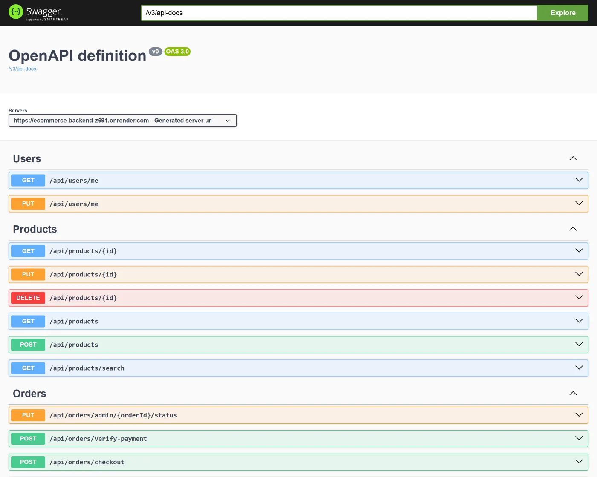

# GUVI Shop — Full-Stack E-Commerce Platform

A production-style e-commerce application: JWT-secured browsing, cart and checkout,
Razorpay payments verified server-side, and an admin panel for catalogue and order
management. Built with **Spring Boot 3.2.5** on **Java 17** and a **React** frontend.

[**Live demo**](https://e-commerce-website-sable-pi.vercel.app/) &nbsp;·&nbsp; Backend on Render, frontend on Vercel



---

## Contents

- [Tech stack](#tech-stack)
- [Architecture](#architecture)
- [Data model](#data-model)
- [API reference](#api-reference)
- [Getting started](#getting-started)
- [Configuration](#configuration)
- [Testing](#testing)
- [Deployment](#deployment)
- [Screenshots](#screenshots)

---

## Tech stack

| Layer | Technology |
|---|---|
| Language | Java 17 |
| Framework | Spring Boot 3.2.5 |
| Security | Spring Security + JWT (`jjwt` 0.11.x), BCrypt |
| Persistence | Spring Data JPA / Hibernate |
| Database | MySQL 8 (default) · PostgreSQL supported |
| Payments | Razorpay Java SDK 1.4.5 |
| API docs | springdoc-openapi 2.5.0 (Swagger UI) |
| Build | Maven |
| Frontend | React, Axios |
| Testing | JUnit 5, Mockito, Spring Boot Test |
| Container | Docker (multi-stage) |

---

## Architecture

A conventional layered Spring Boot application. Every request passes the JWT filter
before it reaches a controller; controllers stay thin and delegate to services, which
own the business rules and talk to repositories.

```
React SPA ──> JwtAuthFilter ──> Controller ──> Service ──> Repository ──> MySQL
   (Axios)    (Spring Security)  (5 classes)   (business    (Spring Data JPA)
                                                 logic)
                                                   │
                                                   └──> Razorpay API
```

**Package layout** (`com.guvi.ecommerce`)

| Package | Responsibility |
|---|---|
| `config` | Security config, JWT filter and utilities, data seeding, `EnvironmentPostProcessor` |
| `controller` | REST endpoints — Auth, Product, Cart, Order, User |
| `service` | Business logic, transaction boundaries |
| `repository` | Spring Data JPA interfaces |
| `entity` | JPA entities mapped to tables |
| `dto` | Request/response payloads — entities are never exposed directly |
| `exception` | Typed exceptions + `@RestControllerAdvice` global handler |

**Design decisions worth noting**

- **Stateless authentication.** `JwtAuthFilter` extends `OncePerRequestFilter` and
  populates the `SecurityContext` per request. No server-side sessions, so the API
  scales horizontally without sticky sessions.
- **JSON error responses.** A custom `RestAuthenticationEntryPoint` and
  `RestAccessDeniedHandler` return a JSON `ApiError` on 401/403 instead of Spring's
  default HTML error page — the SPA can parse every failure the same way.
- **Payments are verified, not trusted.** The client cannot mark an order paid. The
  server creates the Razorpay order, and `POST /api/orders/verify-payment` recomputes
  the HMAC signature before the order transitions state.
- **Price snapshots.** `OrderItem` stores the price at purchase time rather than
  joining through to the live `Product` row, so later price edits don't rewrite history.
- **Deploy portability.** `DatabaseUrlEnvironmentPostProcessor` rewrites Render's
  `DATABASE_URL` (a URI) into the JDBC form Spring expects, before the context starts.

---

## Data model

Five entities across five tables.

```
users 1───N orders 1───N order_items N───1 products
  │                                          │
  └──────── 1───N cart_items ────── N───1 ───┘
```

| Relationship | Mapping | Notes |
|---|---|---|
| `User` → `Order` | `@ManyToOne(LAZY)` on Order | A user places many orders |
| `Order` → `OrderItem` | `@OneToMany(cascade = ALL, EAGER)` | Items live and die with the order |
| `OrderItem` → `Product` | `@ManyToOne(EAGER)` | Plus a stored price snapshot |
| `User` → `CartItem` | `@ManyToOne(LAZY)`, `@JsonIgnore` | Prevents recursion in JSON output |
| `CartItem` → `Product` | `@ManyToOne(EAGER)` | Needed for cart rendering |
| `User.role` | `@Enumerated(STRING)` | Stored as text, not ordinal — safe to reorder the enum |

`users.email` carries a unique constraint. Schema is managed by
`spring.jpa.hibernate.ddl-auto=update`.

---

## API reference

20 endpoints across 5 controllers. Interactive docs are served at
`/swagger-ui/index.html` when the app is running.

### Auth — `/api/auth`

| Method | Path | Auth | Description |
|---|---|---|---|
| `POST` | `/register` | Public | Create an account, returns a JWT |
| `POST` | `/login` | Public | Exchange credentials for a JWT |

### Products — `/api/products`

| Method | Path | Auth | Description |
|---|---|---|---|
| `GET` | `/` | Public | List all products |
| `GET` | `/{id}` | Public | Fetch one product |
| `GET` | `/search` | Public | Search by keyword |
| `POST` | `/` | **ADMIN** | Create a product |
| `PUT` | `/{id}` | **ADMIN** | Update a product |
| `DELETE` | `/{id}` | **ADMIN** | Delete a product |

### Cart — `/api/cart`

| Method | Path | Auth | Description |
|---|---|---|---|
| `GET` | `/` | User | Current user's cart |
| `POST` | `/` | User | Add an item |
| `PUT` | `/{itemId}` | User | Change quantity |
| `DELETE` | `/{itemId}` | User | Remove an item |
| `DELETE` | `/` | User | Empty the cart |

### Orders — `/api/orders`

| Method | Path | Auth | Description |
|---|---|---|---|
| `GET` | `/` | User | Order history |
| `POST` | `/checkout` | User | Create order + Razorpay order |
| `POST` | `/verify-payment` | User | Verify the payment signature |
| `GET` | `/admin/all` | **ADMIN** | All orders |
| `PUT` | `/admin/{orderId}/status` | **ADMIN** | Update fulfilment status |

### Users — `/api/users`

| Method | Path | Auth | Description |
|---|---|---|---|
| `GET` | `/me` | User | Current profile |
| `PUT` | `/me` | User | Update profile |

Authenticated requests send `Authorization: Bearer <token>`.

---

## Getting started

### Prerequisites

- JDK 17+
- Maven 3.8+
- MySQL 8 running locally (or Docker)
- Node.js 18+

### Backend

```bash
cd backend
mvn spring-boot:run
```

Starts on `http://localhost:8080`. The schema is created automatically; a default
admin is seeded on first run (see [Configuration](#configuration)).

### Frontend

```bash
cd frontend
cp .env.example .env     # point it at the backend
npm install
npm start
```

Runs on `http://localhost:3000`.

### With Docker

```bash
cd backend
docker build -t guvi-shop-api .
docker run -p 8080:8080 --env-file .env guvi-shop-api
```

---

## Configuration

Every setting is an environment variable with a local-friendly default.

| Variable | Default | Purpose |
|---|---|---|
| `DB_URL` | `jdbc:mysql://localhost:3306/ecommerce_db?...` | JDBC connection string |
| `DB_USERNAME` | `root` | Database user |
| `DB_PASSWORD` | *(empty)* | Database password |
| `DB_DRIVER` | `com.mysql.cj.jdbc.Driver` | Swap for PostgreSQL if needed |
| `JWT_SECRET` | dev default | **Change in production** — min 32 bytes |
| `RAZORPAY_KEY_ID` | placeholder | Razorpay key |
| `RAZORPAY_KEY_SECRET` | placeholder | Razorpay secret |
| `CORS_ALLOWED_ORIGINS` | `http://localhost:3000` | Allowed frontend origins |
| `ADMIN_SEED_ENABLED` | `true` | Seed an admin account at boot |
| `ADMIN_EMAIL` | `admin@guvi.com` | Seeded admin email |
| `ADMIN_PASSWORD` | `Admin@123` | Seeded admin password |
| `PORT` | `8080` | Server port |
| `JPA_SHOW_SQL` | `false` | Log generated SQL |

> The committed defaults are development conveniences. Set a real `JWT_SECRET`,
> real Razorpay credentials and a strong `ADMIN_PASSWORD` before deploying.

---

## Testing

```bash
cd backend
mvn test
```

**86 tests across 13 classes**, layered to match the application:

| Kind | Scope |
|---|---|
| Service unit tests | `AuthServiceTest`, `ProductServiceTest`, `CartServiceTest` — Mockito, no Spring context |
| Controller slices | `@WebMvcTest` for Product, Cart and Order controllers with a mocked service layer |
| Repository tests | `@DataJpaTest` against an in-memory database |
| End-to-end | `EcommerceWorkflowEndToEndTest` — register → browse → cart → checkout |
| Config | `DatabaseUrlEnvironmentPostProcessorTest` — URI→JDBC rewriting |

---

## Deployment

- **Backend** — Render, from the multi-stage `backend/Dockerfile`. `render.yaml`
  holds the blueprint. `DatabaseUrlEnvironmentPostProcessor` handles Render's
  `DATABASE_URL` format automatically.
- **Frontend** — Vercel, building from `frontend/`. Point `REACT_APP_API_URL` at the
  deployed backend.

---

## Screenshots

**Storefront**



**API documentation — Swagger UI**



---

## Author

**Kshitij Raj** — Java Full Stack Developer
[Portfolio](https://kshitijraj0722.github.io/Kshitij-Portfolio/) ·
[LinkedIn](https://www.linkedin.com/in/kshitij-raj0722) ·
[GitHub](https://github.com/KshitijRaj0722)
